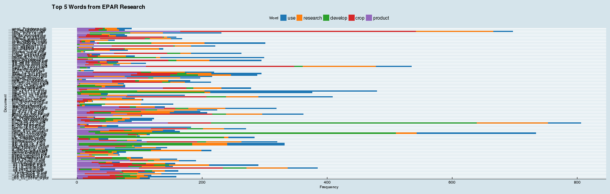
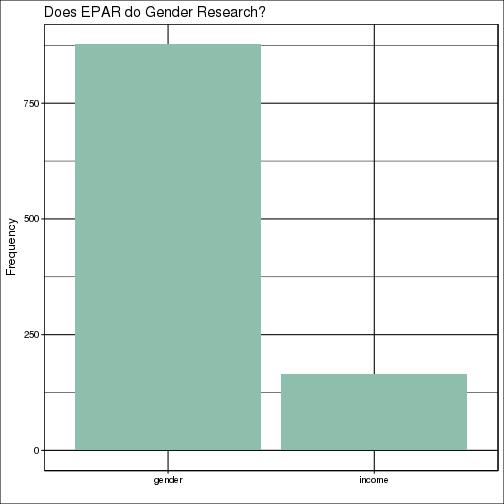
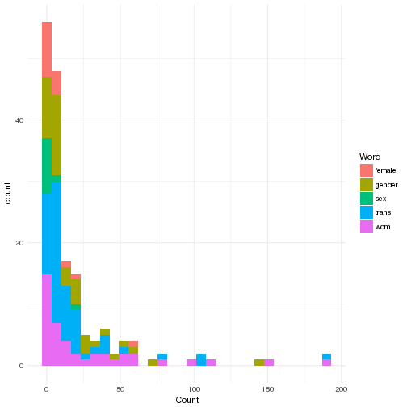
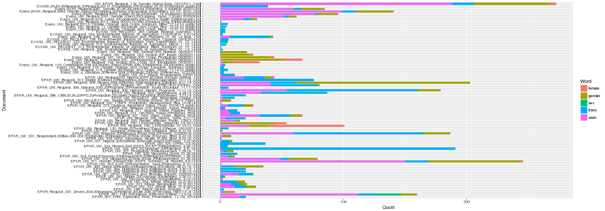
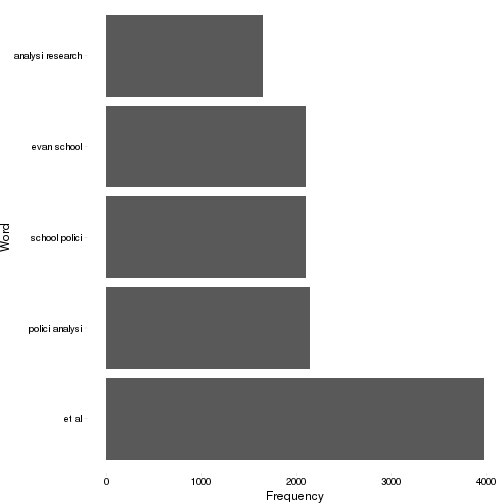

Intro to automated portfolio review: Basic methods, counts, and correlations in EPAR Text Tools
========================================================
author: Ryan P Scott
date: February 2017
width: 1440
height: 900


What's the General Purpose?
========================================================

* Anderson and Reynolds have designed a method of conducting portfolio reviews

* Text processing can serve as a facilitator and enhancer of this process.

* Goal is generally not to replace human coders, but to supplement coders and accomplish tasks which are difficult for human coders rapidly.

Where we are going today
========================================================
Today, we will begin with some basic introductions to text analysis in the R programming environment.

*Focus on extracting words that occur within and across documents
  + Can either be inductive or deductive
  
  + Analyze correlations between words (when the word "indicator" occurs, what words are most likely to co-occur)
  
  + Compare documents based on word frequencies.
  
 
  
  
What we will generally do today
========================================================

For a sentence: *Today, we will begin with some basic introductions to text analysis.*

Remove Punctuation

  + *Today we will begin with some basic introductions to text analysis.*

Split on whitespace
  + *Today,we,will,begin,with,some,basic,introductions,to,text,analysis*

Remove boring words
  + *Today,begin,basic,introductions,text,analysis*
  
Convert to unique id and count
  + *1,1,1,1,1,1*

We dont necessarily need to focus on words
========================================================


We could focus on bytes (characters)
  + *T,o,d,a,y,w,e,w,i,l,l,...* 

We could look at only certain types of words, eg. words longer than six characters
+ *introductions analysis*

***
We could look at ngrams
  + *Today we, we will, will begin, begin,with, with some, some basic, basic introductions, introductions to, to text, text analysis.*
  

**Any time we do text analysis, we make choices, hopefully those choices are motivated by the question at hand**


Different questions, different methods, different solutions 
========================================================


* There is rarely a *right* answer, but there may be a *best* answer. 

* The best answer today may not be the best answer in one month or six months.

* We all can continually learn from one another because the field of data analysis is fast moving contantly changing.

Challenges
========================================================


* [Text is messy.](https://r12a.github.io/uniview/?charlist=Text%20is%20messy.)


* People store things as [PDFs](http://wwwimages.adobe.com/content/dam/Adobe/en/devnet/pdf/pdfs/PDF32000_2008.pdf)
  + Great for humans! Bad for machines.


* Even good documents get corrupted, file types change, drivers get unsupported, packages change etc.

Good News!
========================================================

* Methods are not usually conceptually challenging. Most everything is basic matrices, counts, and correlations. 

* Much of the coding is done for you (whether you use EPAR text tools or not)

* Things WILL go wrong--often they are unique-- when you break something it is a chance to make the tools better!
  
  


Why R?
========================================================
Much text analysis is done using Python, but, that adds another language for EPAR RA's to learn in addition to Stata, SPSS, R.

* By buidling text analysis tools in R, the same skills that might be used to build a shiny application can be used to conduct text analysis.

* R does *almost* everything we need it to do, and we can write commands in R that call Python in the background

**FEWER LANGUAGES = MORE USERS = MORE ANALYSIS**

Running the code
========================================================
The code can be run in R on a local computer, but you need to have administrator priviledges to build rtools.

Thus, the Evans terminal server doesnt work for this. Additionally, some of the things we'll get to next session rely on building a server inside your computer. 

This is very simple with modern cloud computing services but challenges most desktops. 

As a result, I *highly* recommend running the tools remotely using something like google compute engine.

For today, I have already set up a server for us to work on but I've also included directions for how to set up your own server to run the code.

Setting Up a Google Cloud Image
========================================================

First, create an account by going to [https://cloud.google.com/compute/]

Then, in R run the following:

```r
install.packages("devtools")
devtools::install_github("cloudyr/googleComputeEngineR")
```


```r
library(googleComputeEngineR)
#set working directory
setwd("H:")
#point to authentication files downloaded from Google compute setup.
Sys.setenv("GCE_AUTH_FILE"=list.files("Google Keys",full.names=T)[1])
gce_global_zone("us-central1-c")
gce_global_project("epartexttools")
gce_auth()
vm <- gce_vm(template="dynamic",
             dynamic_image="ryscott5/textfree", 
             name = "trial1",
             username="ryscott5", 
             password="temporary",
             predefined_type = "n1-standard-2",
             scheduling=list('preemptible'='true'))
```

What if I want to build a full instance from scratch?
========================================================


```r
library(epartexttools)
RShowDoc("GoogleDirections",package="epartexttools")
```

Using R = Lots of asking for help
========================================================

When in doubt use help commands

```r
#Get help
?library

#Get more help
??library
```
If still in doubt do a google search.
* [Stack overflow](http://stackoverflow.com/questions/tagged/r) is a *very* good resource for R


Upload data to the cloud
========================================================

We would ideally like some data to analyze. Lets start with the example epar data. Here, we download research files from the EPAR page. We can use those to begin building a review of EPAR research.


```r
list.files("demo.docs.folder",full.names = TRUE)[1:5]
```

```
[1] "demo.docs.folder/EPAR_283_SHG_Expanded_Final_Presentation_12_04_2014.pdf"                                     
[2] "demo.docs.folder/EPAR_283_SHG%20Evidence%20Review%20Brief_12.5.14_0.pdf"                                      
[3] "demo.docs.folder/EPAR_Request_201_Drivers%20of%20Inorganic%20Fertilizer%20Use%20in%20Tanzania_090713_af_0.pdf"
[4] "demo.docs.folder/EPAR_REQUEST_295_RTB_Literature_Review_2-22-15FINAL_0.pdf"                                   
[5] "demo.docs.folder/EPAR_UW_199_Wheat_Global_Analysis_7.27.12.pdf"                                               
```

Begin the Workflow
========================================================
Establish a working folder--this is a folder we can save output to as we progress through the analysis. When you run the makeworking command, it will establish a new value "workingfolder"..


```r
epartexttools::makeworking("Research.Grants")
```

```
Good News, Directory Already Exists Containing: corpus_cleaned.RDS
corpus.RDS
```


Read the Documents
========================================================
The allDocs command will read a corpus from a folder, dropping files with errors to build a tm corpus.


```r
corpus1<-allDocs("demo.docs.folder")
```


We then save a copy of the corpus to the workingfolder.

```r
saveRDS(corpus1,file.path(workingfolder,"corpus.RDS"))
```

If we call makeworking again, the rds file will appear in the printout


```r
makeworking("Research.Grants")
```

```
Good News, Directory Already Exists Containing: corpus_cleaned.RDS
corpus.RDS
```

Meanwhile, the object *corpus1* should be in our environment.


```r
ls()
```

```
[1] "corpus1"       "workingfolder"
```

Working with the corpus
========================================================

To work with *corpus1*, we can call commands on the corpus.


```r
class(corpus1)
```

```
[1] "VCorpus" "Corpus" 
```

```r
#Number of Documents in the Corpus
length(corpus1)
```

```
[1] 109
```

Corpus are used in the NLP, openNLP packages, so we can use any command exported from those packages.


```r
NLP::meta(corpus1[1],c("author"))
```

```
$EPAR_283_SHG_Expanded_Final_Presentation_12_04_2014.pdf
[1] "Chris Clark"
```

Basic R Commands
========================================================
Because we rely on infrastructure used by other R packages, we can easily leverage tools from other R packages.

For example, the tm package allows structuring a corpus into a [term document matrix](https://en.wikipedia.org/wiki/Document-term_matrix) or document term matrix.


```r
tdm_unclean<-tm::TermDocumentMatrix(corpus1)
```

TDMs are stored in R as a list, with words stored under the dimnames entry

```r
names(tdm_unclean$dimnames)
```

```
[1] "Terms" "Docs" 
```

```r
sample(tdm_unclean$dimnames$Terms,10)
```

```
 [1] "factors.”"     "(yield)"       "reproduction;" "2004)4,"      
 [5] "mutava,"       "likely.110"    "[0,0]"         "berdegué,"    
 [9] "12.0%"         "(farming,"    
```

Graphing Word Frequency
========================================================
left: 50

```r
wfplots(tdm_unclean,wordcount=5,
        shortendoc = T, typePlot=2)
```


***


**Notice, all of these words are boring!**

* Cleaning documents can help a ton with making our analysis more meaningful.
* Major steps include: 
  + stemming words
  + removing stopwords
  + removing whitespace
  + converting to lowercase

[Duke Guide to Cleaning Tools](http://guides.library.duke.edu/c.php?g=289707&p=1930855)


Cleaning Documents
========================================================

The command *doc clean process* is a wrapper that stems removes stopwords, converts to lowercase, and removes whitespace.


```r
corpus_cleaned<-epartexttools::doc_clean_process(corpus1)
saveRDS(corpus_cleaned,file.path(workingfolder, "corpus_cleaned.RDS"))
```


*Discussion Question:*  What are some potential drawbacks of each of these cleaning steps?


Re-plotting Cleaned Document--Top 5 Words
========================================================

```r
wfplots(tdm_cleaned,wordcount=5,
        shortendoc = T, typePlot=2)
```



***
Hopefully, your plot looks a lot more useful!


Editing Figures
========================================================

You can save your figure to an object,then edit that object

```r
plot1<-wfplots(tdm_cleaned,wordcount=5,shortendoc = T, typePlot=2)
plot1+ggtitle("Top 5 Words from EPAR Research")+ggthemes::theme_economist()
```


Other Plot Types
========================================================

Rather than plotting counts for individual documents, we might want counts for the entire corpus.


```r
plot2<-epartexttools::wfplots(tdm_cleaned,wordcount=5,shortendoc = T, typePlot=1, allCorpus=T)
plot2+ggthemes::theme_fivethirtyeight()+ggtitle('5 most common words in EPAR research') 
```



More Plot Types
========================================================

If we are interested in certain words, we can search for those words by entering a wordlist.


```r
plot3<-epartexttools::interest_plot(tdm_cleaned,wordlist=c("gender","income"))
plot3+ggthemes::theme_foundation()+ggtitle('Does EPAR do Gender Research?') 
```


The underlying matrix
========================================================

We can plot a heatmap showing word freqencies and clustering documents based on the results. Notice, this is just a visual representtion of a term document matrix.


```r
epartexttools::word_heatmap(tdm_cleaned,5, minfreq=2))
```

Interacting with tables
========================================================

Graphs are great, but tayloring the analysis to the exact type needed can be difficult. Thus, 


```r
epartexttools::wordcount_table(wordlist=c("income","gender"),
termDocumentMatrix=tdm_cleaned,corpus1,trunc=T,raw=F)
```

We can also interact with unformated tables
========================================================

```r
tob<-epartexttools::wordcount_table(wordlist=c("sex","gender","wom","female","trans"),termDocumentMatrix=tdm_cleaned,corpus1,trunc=F,raw=T,onlywordlist=T)
```

```r
ggplot(tob)+geom_histogram(aes(x=Count, fill=Word))+theme_minimal()
```



Perhaps a nicer version?
========================================================

```r
ggplot(tob)+geom_bar(aes(x=Document,y=Count,fill=Word),stat="identity",position="stack")+coord_flip()
```



Interacting with tables in raw form
========================================================

We might use that information to identify documents that include gender and income most frequently.


```r
colnames(tob)
```

```
[1] "Word"     "Document" "Count"    "String"  
```

```r
tob2<-ddply(tob,.(Document),Count=sum(Count),summarize)
tob2<-filter(tob2,Count>=quantile(tob2$Count,.5))

genderDocs<-tdm_cleaned[,which(gsub("%",".",tdm_cleaned$dimnames$Docs)%in%tob2$Document)] %>% tm::removeSparseTerms(sparse=.9)
indicators<-genderDocs[str_detect(genderDocs$dimnames$Terms,"indic"),]
indicators
```

```
<<TermDocumentMatrix (terms: 3, documents: 39)>>
Non-/sparse entries: 51/66
Sparsity           : 56%
Maximal term length: 10
Weighting          : term frequency (tf)
```

```r
epartexttools::assocPrettyOneStep(Terms(indicators),genderDocs,corpus_cleaned,corrVal=.95)
```


Comparing documents based on inputs
========================================================

```r
tornadoCompare(tdm<-genderDocs,"seed",3,5)
```


That's great, but what if there are two word strings I want?
========================================================

we can leverage the control options in the TermDocumentMatrix command to select two words, eliminate words, etc. 

```r
BigramTokenizer <-function(x) unlist(lapply(ngrams(words(x), 2),
paste, collapse = " "), use.names = FALSE)
tdm_2gram<-tm::TermDocumentMatrix(corpus_cleaned,
control =list(tokenizer=BigramTokenizer))
wfplots(tdm_2gram, wordcount=5,allCorpus=T)
```



How to load my own documents?
========================================================
It depends!

* Generally, files can be uploaded to rstudio-server by using the files menu in R:
  + https://support.rstudio.com/hc/en-us/articles/218611977-Importing-Data-with-RStudio

*readxl::read_excel ; read.csv() ; can be used to read spreadsheets into R.
*readLines, textConnection can be used to read text strings from the web.
*rvest can be used to scrape websites
*for random file types, try 


Short assignment to work on before the next session...
========================================================

Hi There,

Can you quickly (by machine) run through all the research outputs we have created (stored in the R drive under EPAR/Training and Resources/TextTools) and figure out which research projects involved the following?

"financial services"
"financial inclusion"

We would like you to focus specifically on what research we might have that looks at services and inclusion as they relate to gender.

Pierre has been doing it by hand (cntl f) and from memory, but I think this word searching is pretty basic relative to where the tool is at.

We'd also like to know if there are any other concepts discussed most commonly when services and inclusion are discussed in the context of gender. Obviously we are early on in this project but we would love to free Pierre up to so other standing desk duties.


Thanks, Leigh


