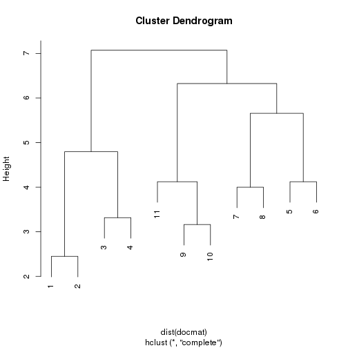

Structured docments provide the opportunity to move beyond adopting all text strings for text analysis. Because structured documents such as forms possess entry areas that specify what is supposedly included in the following lines, we can utilize that structure to help define features of the text or characteristics of the documents. 

In terms of structured documents, there are multple kinds a user may run across. First of all, a structured PDF may have OCR labelled text that is in a similar location across a wide body of documents. These are among the more complicated documents to code as one has to rely on characters either being recognized the same across a range of responses or the text information must remained stored in a similar manner across the corpus. Word documents can have structured form fields--this is much less of a problem for extracting data, and we can rely on commmon tools such as Microsoft Access to batch process results. However, this vignette demonstrates how to utilize R to extract necessary information from form fields rapidly by visually assessing the form document and deciding what information is needed for a database.

#Demonstration
Here, we load agendas from some meetings from the state of Colorado. These tools are mostly built for word files so that's what we demonstrate here.

```r
tfiles<-list.files("~/CRO_form_demo",full.names=T)
tfiles<-tfiles[str_detect(tolower(tfiles),"docx")]
```
Word files area really just xml files. To see the contents of a file, you can use the "docx_table_view()" command.


```r
head(docx_table_view(tfiles[1], export_frame=T,showView=F))
```

```
##                                                                                                                                                          content
## 1                                                                                                                       CO Resiliency Framework Services Project
## 2                                                                                                                                     Week Ending March 14, 2015
## 3                                                                                                                                                 SUMMARY REPORT
## 4                                                                                                                                   Task 1: Resiliency Framework
## 5                                                                                                                                       Activity this past week:
## 6 Attended all sector committee meetings (except housing) for feedback on drafts and review remaining committee deliverables  - Chang, Jankousky, McClurg w/FEMA
```

We can use that structured information to select common elements. When we are unsure what exactly we need from each document but we know what text comes before and after, we can use the cell_extractor function to then select relevent text. For example, if we want the dates from the files above, we would select "CO Resiliency Framework Services Project" and "SUMMARY REPORT" as brackets.


```r
cell_extractor(docx_table_view(tfiles[1],export_frame=T,showView=F)$content,"CO Resiliency","SUMMARY")
```

```
## [1] "Week Ending March 14, 2015"
```

This can then easily be wrapped through documents.


```r
sapply(tfiles, function(X) tryCatch({cell_extractor(docx_table_view(X,export_frame=T,showView=F)$content,"CO Resiliency","SUMMARY")},error=function(e) {NA}))
```

```
## Warning in startint:stopint: numerical expression has 2 elements: only the
## first used

## Warning in startint:stopint: numerical expression has 2 elements: only the
## first used

## Warning in startint:stopint: numerical expression has 2 elements: only the
## first used

## Warning in startint:stopint: numerical expression has 2 elements: only the
## first used
```

```
##  /home/ryscott5/CRO_form_demo/CRO Weekly rpt 3-14-15.docx 
##                              "Week Ending March 14, 2015" 
##  /home/ryscott5/CRO_form_demo/CRO Weekly rpt 3-21-15.docx 
##                              "Week Ending March 28, 2015" 
##  /home/ryscott5/CRO_form_demo/CRO Weekly rpt 3-28-15.docx 
##                              "Week Ending March 28, 2015" 
##   /home/ryscott5/CRO_form_demo/CRO Weekly rpt 3-7-15.docx 
##                               "Week Ending March 7, 2015" 
##  /home/ryscott5/CRO_form_demo/CRO Weekly rpt 4-11-15.docx 
##                                                        NA 
##  /home/ryscott5/CRO_form_demo/CRO Weekly rpt 4-18-15.docx 
##                                                        NA 
##  /home/ryscott5/CRO_form_demo/CRO Weekly rpt 4-25-15.docx 
##                                                        NA 
##   /home/ryscott5/CRO_form_demo/CRO Weekly rpt 4-4-15.docx 
##                                                        NA 
## /home/ryscott5/CRO_form_demo/CRO Weekly rpt2 2-28-15.docx 
##                           "Week Ending February 28, 2015" 
##  /home/ryscott5/CRO_form_demo/CRO weekly rpt 2-14-15.docx 
##                           "Week Ending February 14, 2015" 
##  /home/ryscott5/CRO_form_demo/CRO weekly rpt 2-21-15.docx 
##                           "Week Ending February 21, 2015"
```

Based on the warning, se can see this worked for most of our documents but not all of our documents. One could use the table view command to inspect the files, but we could also use the document cluster command to see how our documents/forms may differ and if that set is meaningfully different. If you had 10000 forms, you obviously couldnt look at them all. 


```r
formcluster(tfiles)
```



We might notice that the first four documents are generally somewhat different from the 5th through 11th documents, suggesting we need to do more to think about how to analyze these forms.


```r
docx_table_view(tfiles[8])
docx_table_view(tfiles[1])
```

