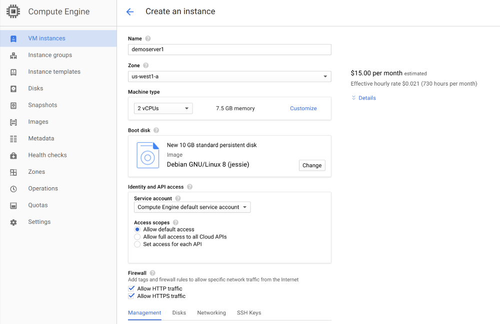
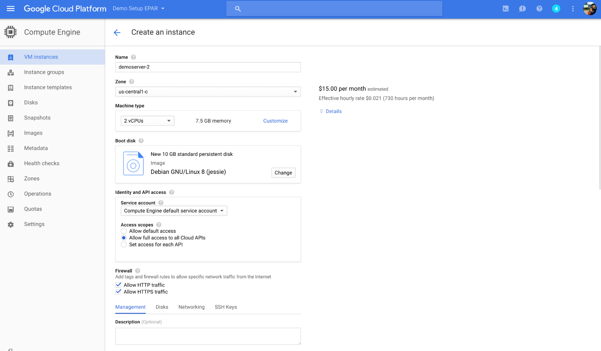

#Startup Script

This document serves as a brief guide for how to set up a server for running the text tools. The server you run should be on a google cloud compute engine. You can run $150 worth of computer time when you first sign up. If you sign up for a standard instance this might happen quickly. Thus the most important thing is that you set up a pre-emptible instance that can be interrupted by Google at any time. As long as you save lots, this is not a problem in practice, but if you forget to save your work will be lost. Second, the key to working effectively with these tools on a pre-emptible instance is to become successful at manipulating github. This is something that is fairly straightforward via rstudio, but might take some time and practice to become comfortable with if you have never used a version tracking tool. 

You can sign of for a google instance by visiting the [Cloud Compute Homepage][https://cloud.google.com/compute/]. If you have never used cloud compute before, you should have a years worth of computing power for free. Click on "Try it free" and then login. Next, click "view my console". Create a new project, noting the name of the project and the project id (both of which you can select). Once you have a project, click on the three bar menu in the top left corner and navigate to compute engine. 

Next, click "create instance".

Use a Debian Jessie boot disk. I might think about expanding the storage on the disk to 15 but 10 will do for now. Upgrade to two CPUs. Also, pick a region (just always be consistent which you pick across a project). Finally, make sure you set the instance to be pre-emptible. This is really really really important. Google Recommends not preempting so you will need to change that menu item. When the server is running, it charges you money. The best way to avoid this is to run the server only when you need it. In practice, this is very very affordable though I recommend setting a budget notification in your cloud console to warn you in case you've left it on. I've been running two servers off and on and have never paid more than $10 a month. A pre-emptible instance automatically shuts down after 24hrs which ends up being a good protective layer. Attached below are images of some acceptable baseline settings for the server.





Make sure, under "Access scopes", to select "Allow Full Access to All Cloud APIs".

Once you have created your instance, you use the instance via the google bash or ssh console. This looks just like a terminal on a mac. Once you are into the google ssh program which should open in chrome, follow the remainder of the directions.

#Directions for setting up a cloud instance.

First, update apt-get, and install java.

```bash
sudo apt-get upgrade
sudo apt-get -y install openjdk-8-jre
sudo apt-get -y install openjdk-8-jdk
sudo apt-get -y install git
```

Next,we add the ability to link to a Google storage bucket. This can be nice if you need to save a publicaly accesible version of a file or if you would like to share files across servers. Essentially, you need to set up a cloud storage bucket. We then install the package that links to the cloud storage bucket. This code links to the bucket I made called epartextools.appspot.com. Otherwise, you can add your own bucket by following the Google directions to create a storage bucket here{link} If you have your own bucket, change that to whatever your bucket is named. Bucket1 is the name of the folder I'm mounting the bucket to in the server I am creating.

```bash
export GCSFUSE_REPO=gcsfuse-`lsb_release -c -s`
echo "deb http://packages.cloud.google.com/apt $GCSFUSE_REPO main" | sudo tee /etc/apt/sources.list.d/gcsfuse.list
curl https://packages.cloud.google.com/apt/doc/apt-key.gpg | sudo apt-key add -
  sudo apt-get update
sudo apt-get -y install gcsfuse
sudo mkdir bucket1
sudo chmod a+w bucket1
gcsfuse epartexttools.appspot.com bucket1
```

Because we are going to be using R and Python and NLP software, we need to install them. First install libcurl, then r, then gdebi, then rstudio server, then wordnet, then java 8. we then add limxml2. 

```bash
sudo apt-get -y build-dep libcurl4-gnutls-dev
sudo apt-get -y install libcurl4-gnutls-dev
sudo echo "deb http://cran.rstudio.com/bin/linux/debian jessie-cran3/" | sudo tee -a /etc/apt/sources.list
sudo apt-key adv --keyserver keys.gnupg.net --recv-key 381BA480
sudo apt-get update
sudo apt-get -y install r-base
sudo apt-get -y install gdebi-core
wget https://download2.rstudio.org/rstudio-server-0.99.903-amd64.deb
sudo gdebi rstudio-server-0.99.903-amd64.deb
gcloud compute firewall-rules create allow-rstudio --allow tcp:8787
sudo apt-get -y install wordnet
sudo apt-get -y install openjdk-8-jre
sudo apt-get -y install libxml2-dev
sudo apt-get -y install antiword
sudo apt-get -y install xpdf
sudo apt-get -y install libemail-outlook-message-perl libemail-sender-perl
pip install https://github.com/mattgwwalker/msg-extractor/zipball/master
```

Try this command to make sure the packages are set up proprly for installing packages for rstudio

```bash
R CMD Sys.setenv(PKG_CONFIG_PATH="/usr/lib/x86_64-linux-gnu/pkgconfig")
```

Next add a password for yourself where USERID is the userid you'd like to use. Replace that with your google id and follow prompts.

```bash
sudo passwd USERID
```

Next we are going to install docker and the cliff geoserver. This will allow you to geocode documents.

```bash
sudo apt-get -y install docker.io
sudo git clone https://github.com/johnb30/cliff-docker
cd cliff-docker
sudo docker build -t cliff:2.1.1 .
docker run -p "8080:8080" -d cliff:2.1.1
sudo docker ps
sudo docker stop
```

Now, you can log into rstudio-server by visiting the IP address for your instance followed by :8787. Do not add https to the front of the IP address or it wont work.

For SHINY server, follow build instructions:
https://github.com/rstudio/shiny-server/wiki/Building-Shiny-Server-from-Source


Future Code for Tensorflow
```bash
wget https://github.com/bazelbuild/bazel/releases/download/0.2.2b/bazel_0.2.2b-linux-x86_64.deb
sudo dpkg -i bazel_0.2.2b-linux-x86_64.deb
#Then run

wget https://bootstrap.pypa.io/get-pip.py
sudo python get-pip.py
sudo pip install -U protobuf==3.0.0b2
sudo pip install asciitree
sudo pip install numpy
git clone --recursive --recurse-submodules https://github.com/tensorflow/models.git
cd models/syntaxnet/tensorflow
./configure
cd ..

sudo update-alternatives --config java

sudo update-alternatives --config javac
sudo apt-get install python-dev
bazel test syntaxnet/... util/utf8/...
```


